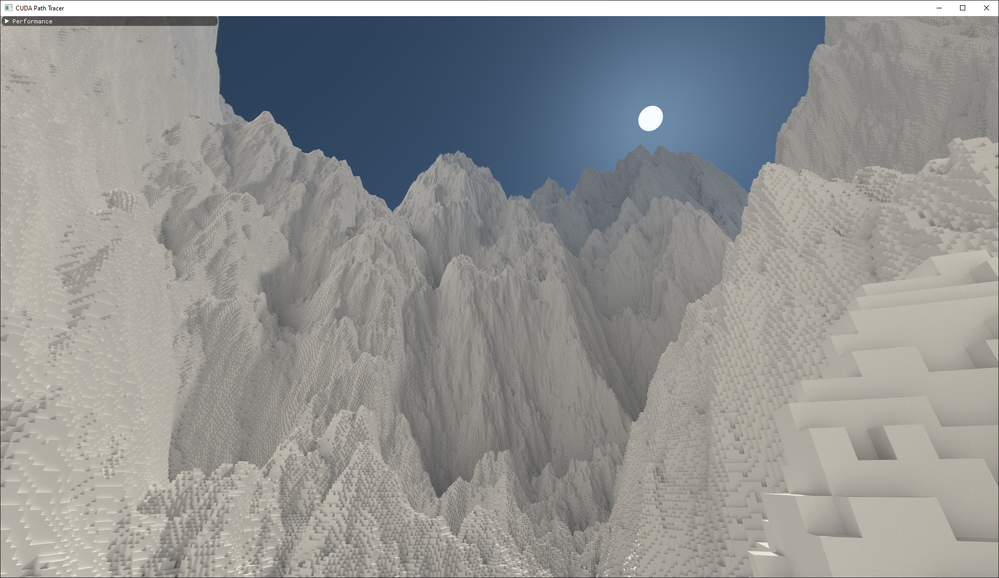
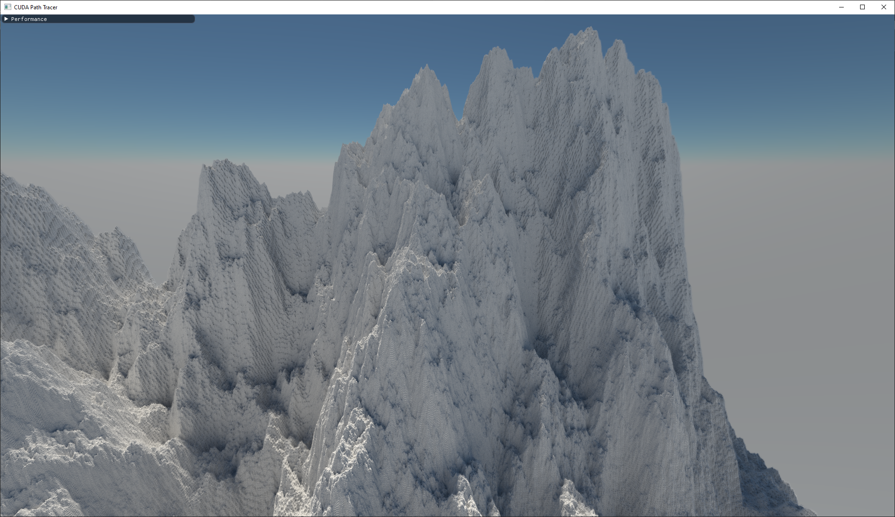
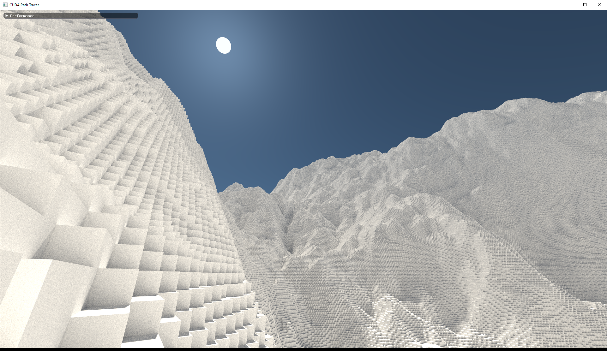
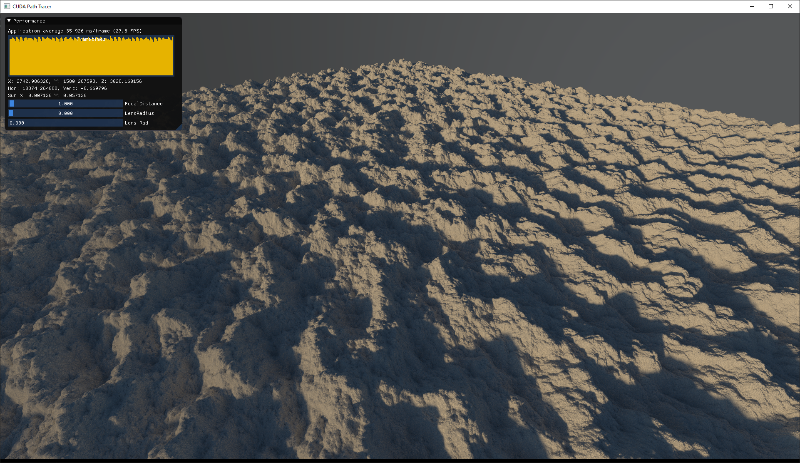
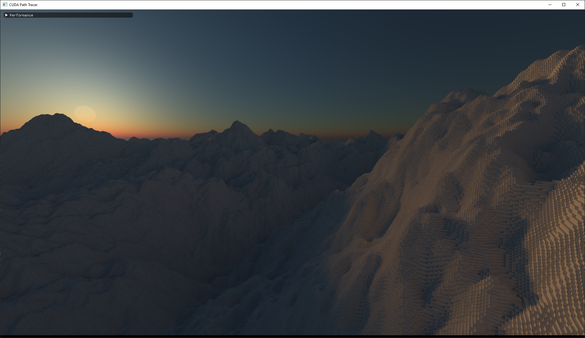

# BrickMap

The system is based on [this paper](https://studenttheses.uu.nl/handle/20.500.12932/20460) with some adjustments to reduce memory and add LoDs. One important improvement is that the paper does one allocation per "Brick" (8x8x8 voxel block) on the GPU. Instead of using pointers we can simply use indices that index into a linear block of memory. When due to the streaming system the block of memory fills up we simply double its size (allocate a bigger memory chunk and copy the old bricks). To keep the index small and further improve data locality, we divide the world in superchunks each composed of 16x16x16 normal 8x8x8 bricks which means that the maximum index value is 4095 (16x16x16) which only takes up 12 bits. The standard size of the brick storage for a superchunk is 256 * 64 bytes which should fit one surface worth of bricks (16x16). We double the storage size every time it fills up, so 256->512->1024->etc...

When a ray hits a brick that has not yet been loaded on the GPU it will add the request to a request buffer. The CPU will then upload the brick to the GPU. This way only bricks that lay on the surface of a superchunk will be loaded since rays won't penetrate into the inside of a superchunk.

Since a superchunk contains 4096 bricks (16x16x16), we only need 12 bits for an index which leaves us with either 4 or 20 bits depending on whether we use a 16 bit or a 32 bit index. 3 of these bits are used for flags for the streaming system (brick_loaded, brick_unloaded, brick_requested). Since there are no hardware atomics for 16 bit integer datatypes and rolling our own would be slow, we use a 32 bit index. By using a 32 bit index we are left with 17 bits that we can use for other purposes such as a 2x2x2 LoD which uses only 8 bits. In total there are 3 LoD levels, 8x8x8, 2x2x2, 1x1x1 which is the finest. Rendering performance wise I saw no big difference in frametimes/rate, but the number of chunks requested to be streamed did decrease significantly.

Unfortunately Cuda does not offer access to the hardware accelerated ASTC/DXT1 texture decompression which I could use to store colors per voxel. This would mean that I would have to write a software decompressor which would probably be a lot slower. Voxel terrain data is inherently well suited for these types of texture compression as they are often gradient like in color. Maybe some type of specialistic voxel color compression algorithm could be devised for this.

## Build Instructions

1. Clone [vcpkg](https://github.com/microsoft/vcpkg) somewhere central (eg. "C:/")
`git clone https://github.com/Microsoft/vcpkg.git`
2. Run `vcpkg/bootstrap-vcpkg.bat` or `vcpkg/bootstrap-vcpkg.sh`
3. Add an environment variable to your system:
- `VCPKG_ROOT`: the location where vcpkg is installed (e.g. "C:\vcpkg")
4. Open with Visual Studio (folder mode) and hit compile or `cmake --build --preset Release`
5. Dependencies will be automatically compiled, might take a minute or two
